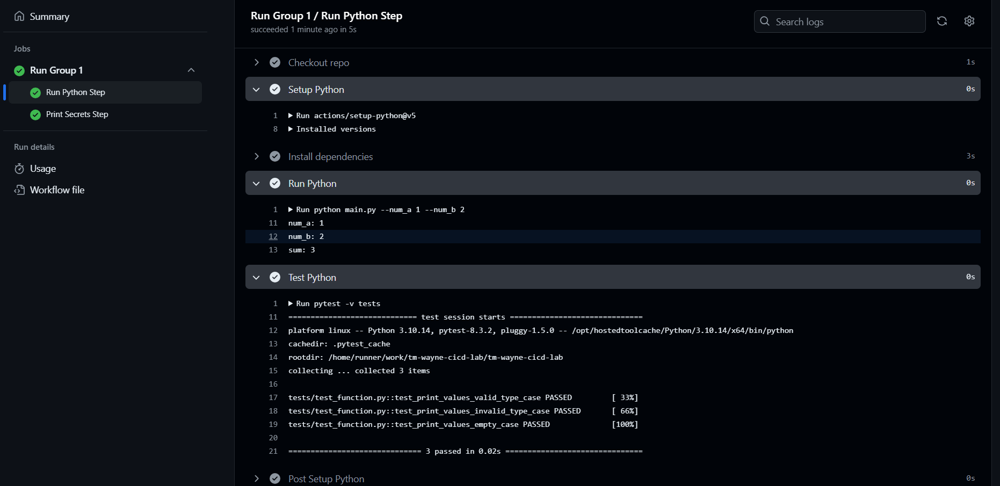
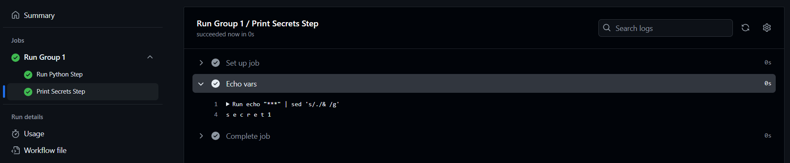
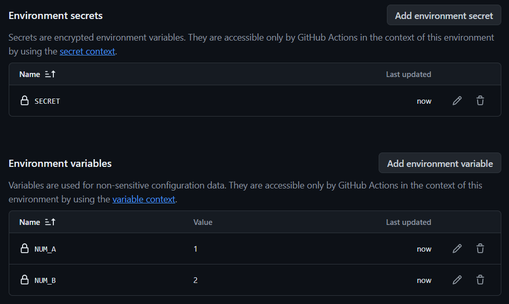

<h1 align="center">
     </img>
</h1>
<h1 align="center">
     </img>
</h1>


<p align="center">
  Talent Engine Lab Output 6 - Wayne Matthew Dayata<br><br>
  <i>Setting up Github Workflow and CI/CD</i><br><br>
</p>

## Overview

In this project, we created a workflow in Github to run a sample Python script with varying environment groups to demonstrate basic CI/CD.

The following steps summarize the lab's tasks:
1. Create a simple python script that:
    - Accepts 2 parameters (num_a,num_b)
    - Print the values of the parameters and their sum.
2. Create 2 Github Environment Group with these settings:
    - NUM_A 	= 1 | 10
    - NUM_B 	= 2 | 20
    - SECRET 	= secret1 | secret2
3. Create 2 Github Action Workflows with steps:
    - Uses templates
    - Runs the python script (checkout > setup-python > install dependencies > run python script > run test script)
    - Runs CLI command to print unencrypted secret value (appending `| sed ‘s/./& /g’`) after running the python script 
4. Run Github actions for both workflows.

Notes:
- In addition to the sample function, a unit test for the function is also made to simulate unit testing in the workflow. 
- Exception handling is also implemented.

Assumptions:
- The repository is made public, or
- The repository is made private and the organization is subscribed with a plan that grants access to environments and workflows in private repositories.

## Table of Contents
1. [Overview](#overview)
2. [Table of Contents](#table-of-contents)
3. [Outputs](#outputs)
4. [Directory](#directory)
5. [Setup](#setup)
    - [Running the Project Locally (Optional)](#running-the-project-locally-optional)
    - [Activate the Workflows](#activate-the-workflows)
6. [Contributing](#contributing)
    - [Resource Requests and Bug Fixes](#resource-requests-or-bug-reports)
7. [Credits](#credits)


## Outputs

#### Environment Groups


- Configuration of the environment variables under **Settings**.

#### Python Job Results


- The environment variables were correctly extracted from the environment group and fed as arguments to the run command, resulting in `1 + 2 = 3` (and `10 + 20 = 30` for Group 2).

#### Secrets Results


- The SECRET value were correctly displayed by appending `| sed 's/./& /g'` to the echo command to unmask the asterisks.

## Directory

| Name | Description |
| ---- | ----------- |
| `.github/workflows` | Workflows that can be run in GitHub |
| `src/` | Directory that contains the sample utility function |
| `tests/` | Directory that contains the test for the sample utiity function. |
| `main.py` | The python script to be launched in the workflow run |

## Setup

Before you begin, ensure you have done the following:

### Running the Project Locally (Optional)

**Installing dependencies:**

- `argparse` - Parse arguments from the command line.

- `pytest` - Aid in unit testing of Python scripts
    ```
    pip install argparse pytest
    ```
**Clone the Repository:**

- Clone the current project and navigate to the project directory.

    ```bash
    git clone https://github.com/tm-wayne-dayata/tm-wayne-cicd-lab.git
    cd tm-wayne-cicd-lab
    ```

- Run the Python script:

    ```bash
    python main.py --num-a NUM_A --num-b NUM_B
    ```

    - Replace `NUM_A` and `NUM_B` with **integers**. 
    - Exception handling related to not supplying an argument or supplying non-integer arguments is implemented.

- Run the unit test:

    ```bash
    pytest tests
    ```

### Activate the Workflows

1. Go to the **Actions** tab. 
2. In the sidebar, click any of the following actions:
    - Group 1 Workflow
    - Group 2 Workflow
3. Expand the **Run workflow** dropdown and click **Run workflow**.
4. Refresh the page, then click the workflow in the table.
5. Click any of the jobs in the workflow lineage.
6. View the outputs. Contents should be similar to the [images above](#python-job-results).

## Contributing

We'd love your help in improving the website with your own content & fixes. Here are some ways you can help:

- Before doing anything, read our [Code of Conduct](https://github.com/tm-wayne-dayata/tm-wayne-cicd-lab/blob/main/.github/CODE_OF_CONDUCT.md).
- Read our [Contributing guidelines](https://github.com/tm-wayne-dayata/tm-wayne-cicd-lab/blob/main/.github/CONTRIBUTING.md) for making a pull request to edit the repository yourself.
- [Raise issues](https://github.com/tm-wayne-dayata/tm-wayne-cicd-lab/issues/new/choose) to; correct wrong or misleading content, request more notes, or to fix broken links or outdated resources.
- [Fork the repository](https://github.com/tm-wayne-dayata/tm-wayne-cicd-lab/fork) and work on changes on your local machine.

### Resource Requests or Bug Reports

[Create an issue](https://github.com/tm-wayne-dayata/tm-wayne-cicd-lab/issues/new/choose) while following the specific templates.

## Credits

Thank you Jillian and the rest of the TE mentors and facilitators for walking us through with Ci/CD and GitHub Actions. Your efforts really inspire us sprouts to continue upskilling in our Data Engineering Journey.
